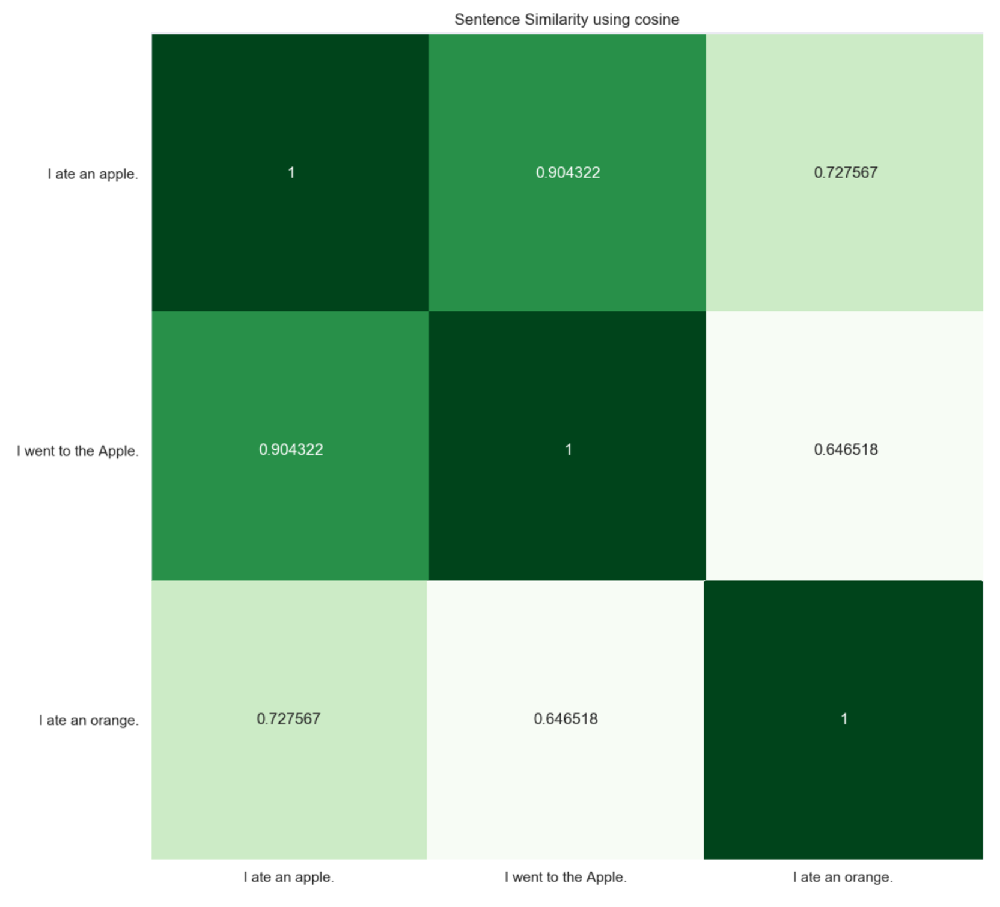

# Sentence Similarity
This repo contains various ways to calculate the similarity between source and target sentences. You can choose **the pre-trained models** you want to use such as _ELMo_, _BERT_ and _Universal Sentence Encoder (USE)_.

And you can also choose **the method** to be used to get the similarity:

    1. Cosine similarity
    2. Manhattan distance
    3. Euclidean distance
    4. Angular distance
    5. Inner product
    6. TS-SS score
    7. Pairwise-cosine similarity
    8. Pairwise-cosine similarity + IDF
    
You can experiment with (**The number of models**) x (**The number of methods**) combinations!
    
<br/>

## Installation
- After cloning this repository, you can simply install all the dependent libraries described in `requirements.txt` with `pip install -r requirements.txt`.
```
git clone https://github.com/Huffon/sentence-similarity.git
cd sentence-similarity
pip install -r requirements.txt
```

<br/>

## Usage
- To test your sentences, you should fill out `corpus.txt` with sentences as below.
```
I ate an apple.
I went to the Apple.
I ate an orange.
...
```
- Then, choose the model and method to be used to calculate the similarity between source and target sentences.
```
python sensim.py
    --model    MODEL_NAME
    --method   METHOD_NAME
    --verbose  LOG_OPTION (bool)
```

<br/>

## Examples
- In the following section, you can see the result of `sentence-similarity`.
- As you guys know, there is a no **silver-bullet** which can calculate perfect similarity between sentences. You should conduct various experiments with your dataset.
    - _**Caution**_: `TS-SS score` might not fit with short-sentence similarity task, since this method originally devised to calculate the similarity between documents.
- Result:

<p align="center">
  
</p>

<br/>

## Requirements
- Python version should be higher than **3.6.x**
- You should install **PyTorch** via official [Installation guide](https://pytorch.org/get-started/locally/)
```
allennlp==0.9.0
bert-score==0.2.1
numpy==1.17.3
scikit-learn==0.21.3
scipy==1.3.1
seaborn==0.9.0
sentence-transformers==0.2.3
spacy==2.1.9
tensorflow==1.15.0
tensorflow-hub==0.7.0
torch==1.3.0
```

<br/>

## TODO
- Add pairwise cosine similarity method in `use_elmo`.
- Add `InferSent`, `Sent2Vec`, plain `GloVe` as models.
- Upgrade TF to TF2.0 to use `USE 3`

<br/>

## References
### Papers
- [Universal Sentence Encoder](https://arxiv.org/abs/1803.11175)
- [Deep contextualized word representations](https://arxiv.org/abs/1802.05365)
- [BERT: Pre-training of Deep Bidirectional Transformers for Language Understanding](https://arxiv.org/abs/1810.04805)
- [Sentence-BERT: Sentence Embeddings using Siamese BERT-Networks](https://arxiv.org/abs/1908.10084)
- [A Hybrid Geometric Approach for Measuring Similarity Level Among Documents and Document Clustering](https://ieeexplore.ieee.org/document/7474366/metrics#metrics)


### Libraries
- [TF-hub's Universal Sentence Encoder](https://tfhub.dev/google/universal-sentence-encoder/2)
- [Allen NLP's ELMo](https://github.com/allenai/allennlp)
- [Sentence Transformers](https://github.com/UKPLab/sentence-transformers)
- [BERTScore](https://github.com/Tiiiger/bert_score)
- [Vector Similarity](https://github.com/taki0112/Vector_Similarity)


### Articles
- [An Overview of Sentence Embedding Methods](http://mlexplained.com/2017/12/28/an-overview-of-sentence-embedding-methods/)
- [Comparing Sentence Similarity Methods](http://nlp.town/blog/sentence-similarity/)